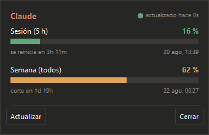

# Claude Usage Monitor

Monitor de consumo del plan de Claude para la bandeja del sistema de Windows.
Muestra lo mismo que la sección *Usage* de la app y que `/usage` en Claude Code,
pero siempre a la vista y sin abrir nada.

<p align="center">
  
</p>

## Qué muestra

- **Sesión (5 h)**: porcentaje consumido y cuánto falta para que se reinicie.
- **Semana**: porcentaje consumido y cuánto falta para el corte semanal.
- **Semana (Opus / Sonnet)**: aparecen solo si la API los reporta. En planes Pro
  llegan a `null` —el consumo de Opus va dentro del semanal general— así que no
  se pinta ninguna fila para ellos.

El icono cambia de color según el consumo más alto: verde (<50 %), ámbar
(50-80 %) y rojo (>80 %); gris cuando no hay datos o falla la conexión. El
anillo exterior es la sesión de 5 h y el disco interior, la semana.

<p align="center">
  
</p>

| Interacción | Resultado |
|---|---|
| Pasar el cursor por el icono | Tooltip con los porcentajes y los tiempos restantes |
| Clic izquierdo | Panel con barras, cuentas atrás y hora exacta del reset |
| Clic derecho | Menú: actualizar, iniciar con Windows, cerrar sesión, salir |

---

## Instalación

1. Ejecuta `ClaudeUsageMonitor-Setup.exe`.
2. Marca *Iniciar automáticamente con Windows* si quieres que arranque solo.
3. La primera vez en cada equipo se abre una ventana de conexión:
   - Pulsa **Abrir navegador**, inicia sesión en Claude y autoriza el acceso.
   - El navegador vuelve solo a la app: **no hay que copiar ningún código**.
   - La sesión queda guardada y no se vuelve a pedir.

   Si el navegador no puede volver (sesión remota, cortafuegos que bloquea el
   puerto local), la página muestra un código para pegarlo a mano en el campo
   de respaldo de la misma ventana.

No hace falta tener Claude Code instalado: la app usa su propia sesión.

### El icono no aparece en la barra de tareas

Windows esconde los iconos nuevos en el desplegable **^** del área de
notificación. Para fijarlo: arrástralo desde ese desplegable hasta la barra, o
ve a *Configuración → Personalización → Barra de tareas → Seleccionar los iconos
que aparecen en la barra de tareas* y activa **ClaudeUsageMonitor**.

### Dónde se guardan los datos

`%APPDATA%\ClaudeUsageMonitor\`

| Fichero | Contenido |
|---|---|
| `credentials.bin` | Sesión OAuth cifrada con **DPAPI** (solo la descifra tu usuario de Windows en ese equipo) |
| `settings.json` | Intervalo de sondeo y último consumo conocido (para pintar el icono al arrancar) |
| `app.log` | Registro rotatorio, útil si algo falla |

Al desinstalar se borra toda la carpeta.

---

## Cómo funciona

| Pieza | Detalle |
|---|---|
| Datos | `GET https://api.anthropic.com/api/oauth/usage` con `Authorization: Bearer` y `anthropic-beta: oauth-2025-04-20` |
| Login | OAuth 2.0 con PKCE (S256) contra `https://claude.com/cai/oauth/authorize` |
| Retorno | Servidor HTTP efímero en `127.0.0.1:<puerto libre>`; el navegador vuelve solo, igual que el cliente oficial |
| Canje | `POST https://platform.claude.com/v1/oauth/token` (JSON; `state` es **obligatorio**) |
| Sesión | Access token de 8 h, renovado automáticamente con el refresh token (5 min antes de caducar o ante un 401) |
| Sondeo | Cada 60 s, con espera progresiva hasta 5 min si falla la red |

> **Ojo con el host de autorización.** `https://claude.ai/oauth/authorize` todavía
> pinta la pantalla de consentimiento, pero al pulsar *Autorizar* el POST de
> aprobación devuelve `400 Invalid request format` y el navegador muestra
> "Error de autorización". El flujo vigente es el de `claude.com/cai`, con
> retorno a `localhost`. `tools/selftest.py` vigila que no se vuelva atrás.

**Aviso**: `/api/oauth/usage` es un endpoint interno de Anthropic, no
documentado. Devuelve los datos de tu propia cuenta, pero puede cambiar sin
previo aviso. Si eso ocurre, la app no se cierra: el icono se pone gris, el
panel indica el fallo y sigue reintentando; el motivo queda en `app.log`.

La app **no toca** las credenciales de Claude Code (`~/.claude/.credentials.json`):
tiene su propia sesión, así que renovarla nunca invalida la del CLI.

---

## Desarrollo

```powershell
python -m venv .venv
.\.venv\Scripts\python.exe -m pip install -r requirements.txt

.\.venv\Scripts\python.exe app.py            # normal (pide login si hace falta)
.\.venv\Scripts\python.exe app.py --demo     # datos de ejemplo, sin login
.\.venv\Scripts\python.exe tools\selftest.py # comprobaciones sin red ni interfaz
```

> Con el Python de **Microsoft Store**, `%APPDATA%` y el registro se redirigen a
> `%LOCALAPPDATA%\Packages\PythonSoftwareFoundation.Python.*\LocalCache\Roaming\`.
> Es solo cosa del intérprete: el `.exe` compilado escribe en las rutas reales.
> Para desarrollar cómodamente, instala Python de python.org
> (`winget install Python.Python.3.13`).

### Diagnóstico del login

```powershell
.\.venv\Scripts\python.exe tools\auth_probe.py --hosts     # comprueba los endpoints de token
.\.venv\Scripts\python.exe tools\auth_probe.py             # login completo por consola
.\.venv\Scripts\python.exe tools\auth_probe.py --url-only  # imprime la URL sin abrir el navegador
```

El probe hace el recorrido entero e informa de cada paso: URL, retorno del
navegador, canje del código, consulta de uso y renovación con el refresh token.

### Compilar

```powershell
winget install JRSoftware.InnoSetup      # solo la primera vez
.\build\build.ps1                        # dist\ClaudeUsageMonitor.exe + instalador
.\build\build.ps1 -SoloExe               # solo el .exe portable
```

El script crea su propio entorno, genera el icono, ejecuta `selftest.py` y
**aborta si alguna comprobación falla**.

### Estructura

```
src/claude_usage/
  __main__.py     arranque, instancia única y unión de las piezas
  config.py       constantes, rutas y formato de tiempos
  store.py        cifrado DPAPI, credenciales y ajustes
  auth.py         PKCE, servidor de retorno, canje y refresco de tokens
  api.py          cliente del endpoint y modelo UsageSnapshot / Limite
  errors.py       fallo temporal (se reintenta) vs. fallo de sesión (pide login)
  poller.py       hilo de sondeo con reintento progresivo
  icons.py        dibujo del icono según el consumo
  tray.py         icono de bandeja, tooltip y menú
  panel.py        panel emergente sobre la bandeja
  login_window.py ventana de conexión del primer arranque
  autostart.py    arranque con Windows (HKCU\...\Run)
  winutil.py      DPI, área de trabajo e instancia única
```

tkinter es el dueño del hilo principal; el icono de la bandeja y el sondeo
corren en hilos aparte y devuelven todo a la interfaz con `root.after`.

---

## Hecho con IA

Este proyecto lo escribió **Claude Opus 5 a través de Claude Code**, en una
sesión dirigida por el dueño del repositorio: los requisitos, las decisiones de
producto (icono en bandeja en vez de widget flotante, sesión propia en vez de
reutilizar la de Claude Code, instalador en vez de portable) y las correcciones
sobre la marcha son humanas; el código, la documentación y las comprobaciones
los generó el modelo. Se dice aquí porque quien lea el repo merece saberlo.

Qué significa eso en la práctica, con concreción:

- **Verificado contra el servicio real, no supuesto.** El endpoint de uso se
  probó en vivo y el parseo se contrastó con el payload real de una cuenta Pro.
  El flujo OAuth se ejecutó de punta a punta: autorización, canje del código,
  consulta de uso y renovación con el refresh token. El `.exe` y el instalador
  se compilaron y ejecutaron en Windows 10.
- **El flujo OAuth se dedujo, no se copió de una documentación.** No existe
  documentación pública. El `client_id` salió del binario del cliente oficial
  instalado en la máquina, y el host de autorización vigente se recuperó
  comparando con una URL de login real. El primer intento (`claude.ai`) fallaba
  con `400 Invalid request format` al aprobar; el porqué quedó documentado más
  arriba en vez de esconderse.
- **Lo que no tiene.** No hay suite de tests unitarios ni CI: `tools/selftest.py`
  es una treintena de comprobaciones rápidas sin red que cubren el parseo, la
  construcción de la URL de autorización, la clasificación de errores, los
  formatos y el dibujo del icono. La interfaz se validó a ojo con capturas, no
  automáticamente.

## Limitaciones conocidas

- **Solo Windows.** DPAPI, bandeja del sistema y clave `Run` del registro.
- **Depende de un endpoint no documentado** que Anthropic puede cambiar.
- **Planes Pro no reportan Opus por separado**, así que no hay fila para Opus.
- **Sin firma de código**: SmartScreen puede avisar la primera vez que ejecutes
  el instalador.

## Licencia

MIT — ver [LICENSE](LICENSE).
